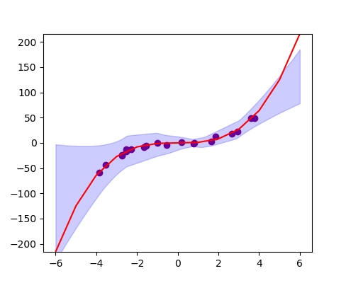

# Simple and Scalable Predictive Uncertainty Estimation using Deep Ensembles

This code attempts to reproduce the toy example described in the paper:
_Simple and Scalable Predictive Uncertainty Estimation using Deep Ensembles_
by Balaji Lakshminarayanan, Alexander Pritzel, Charles Blundell, from DeepMind
accepted at NIPS 2017 (http://bit.ly/2C9Z8St)

As of now, I did not implement the fast gradient sign method yet.

